  
    
  
    
  <table><tr>
    <td valign="top"></td>
    <td valign="top"></td>
  </tr></table>

<h3 align="center">
Building scalable backend systems, real-time infrastructure, and cloud-native applications.
</h3>

---

#  About Me

I'm a backend-focused software engineer passionate about designing systems that are:

- ⚡ High-performance  
- 🔄 Real-time and event-driven  
- ☁️ Cloud-native and scalable  
- 🔐 Secure and reliable  

I enjoy working on backend architectures, distributed systems, networking layers, and infrastructure-focused applications.

---

#  Current Focus

- Real-time communication systems & WebSockets  
- Distributed backend architectures  
- API performance optimization  
- Cloud-native engineering  
- AI infrastructure & backend integrations  

---

# 🛠️ Tech Stack

## 💻 Languages

  

## Frameworks & Technologies

  

## ☁️ Infrastructure & DevOps

  

---

#  Engineering Interests

- 🔌 Real-Time Systems & WebSocket Infrastructure  
- 🌐 Distributed Systems & Networking  
- 🔐 Authentication & Backend Security  
- ☁️ Cloud Architecture & Scalability  
- 🤖 AI Systems Infrastructure  

---

# 📬 Connect With Me

  

  

---

# 💭 Philosophy

> *"I enjoy building backend systems that are fast, scalable, reliable, and designed for real-world performance."*

---

### Projects

- **[Ripple MCP](https://github.com/Mechantchulo/Ripple-MCP)** — Project-aware tools for coding agents through MCP.
- **NeuralBridge** — Assistive AI combining speech, emotion, and gesture capabilities.
- **CyberSOC** — Security monitoring that turns suspicious web activity into incidents and explanations.
